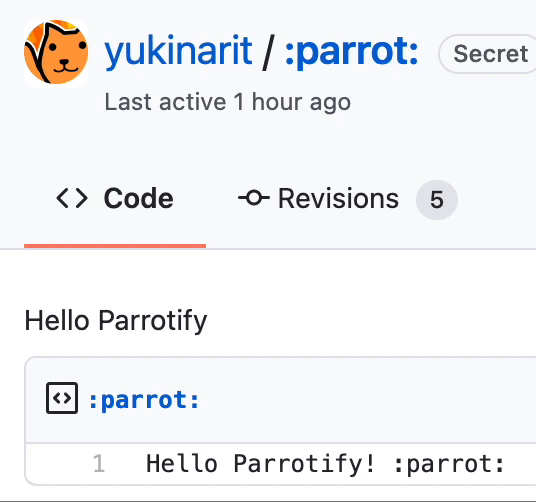
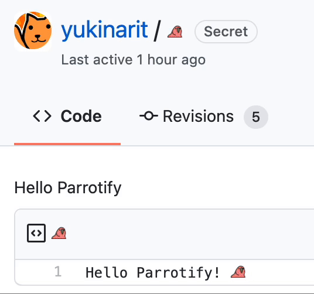
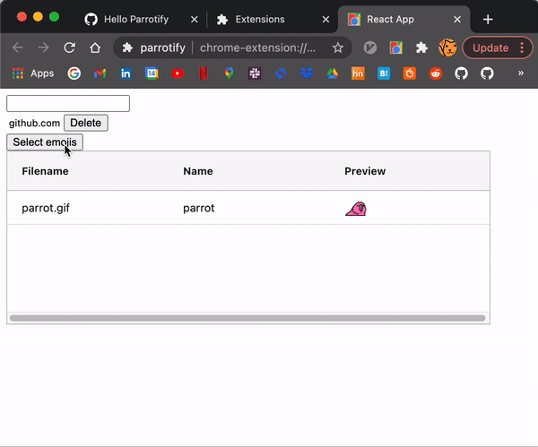

# Parrotify :thumbsupparrot:

Parrotify is a google chrome extension to allow custom GIF emoji displayed in your browser!
(This project is still in early stages! It's so buggy!)


Without Parrotify             |  With Parrotify
:-------------------------:|:-------------------------:
  |  

## Features

Also, you can add your favorite emoji from option page.




## Installation

Parrotify is not yet in Chrome web store, so you need to build from the source.

* Clone the repository
    ```
	$ git clone git@github.com:yukinarit/parrotify.git
    ```
* Build
    ```
	$ cd option-app
	$ npm i
	$ npm run build
    ```
* Load parrotify
    * Open Google chrome
	* Type `chrome://extensions` in address bar
	* Click `Load unpacked`
	* Choose `parrotify` directory

## How does it work?

Very simple. Chrome extension allows to insert a javascript code in the page a user visits, it's called [Content Script](https://developer.chrome.com/docs/extensions/mv2/content_scripts/). Parrotify searches emoji text such as `:parrot:` in a page and replace it with `img` of image file.

But scanning a page is quite slow, and block the browser rendering!  Parrotify implements the following techniques to workaround the perforance issue.
* Filter page by pattern to prevent Parrotify from running in unwated pages
* Cache emoji image data in memory
* Specify [document_idle](https://developer.chrome.com/docs/extensions/mv2/content_scripts/) in `manifest.json` to run the content after a page loaded
* Use [requestIdCallback](https://developer.mozilla.org/en-US/docs/Web/API/Window/requestIdleCallback) to defer the execution when a browser is idle.
     * After scanning a page and found elements that contain emoji text, create a task per element push in the task queue
	 * The callback registered in `requestIdCallback` pops a task and execute it when the browser idle
	 * A task replaces the emoji text with `img` of image file

## TODO

* [ ] Use [ag-grid](https://github.com/ag-grid/ag-grid) for url table in option page
* [ ] Add popup page
* [ ] Allow deleting emoji in option page
* [ ] Allow specifying emoji scale factor per element. The currently it's hardcoded in [the source](https://github.com/yukinarit/parrotify/blob/master/script.js#L13-L18)

## CONTRIBUTING

The auther is not an expert in frontend. I'd appreciate helps like
* Feature and bugfix
* Improve performance
* Give Feedback
* Docuentation

## LICENSE

MIT
